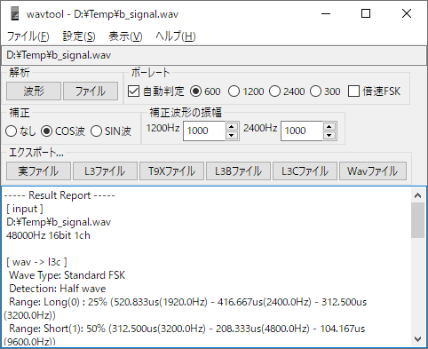

#  WAVTOOL

### WAVTOOLは、日立ベーシックマスターレベル3やMB-S1のテープ音声データとそれらのエミュレータにて使用するテープイメージを変換するものです。
また、テープイメージからテープのヘッダ部分を取り除いたり、逆に付加してテープイメージを作成する際にも使用できます。

### [ダウンロード](https://github.com/bml3mk5/WavTool/releases)

### [ドキュメント](../../tree/main/docs)

------------------------------------------------------------------------------
### WAVTOOL is an application that converts tape audio data on Hitachi Basic Master Level 3 and MB-S1 and tape images which used in these emulators.
You can also use this to add or remove a header of a tape image.

### [Downloads](https://github.com/bml3mk5/WavTool/releases)

### [Documents(Japanese)](../../tree/main/docs)

------------------------------------------------------------------------------

## Disclaimer 免責事項

* This is the free software. I have not abandoned the copyright.
  And each author which created the source code also have the copyright.
* これはフリーソフトです。ただし著作権は放棄していません。
  ソースコードを作成した各々の作者にも著作権があります。
* No warranty: We are not responsible for any damage caused by this software.
* 無保証: このソフトを使用したいかなる損害も一切保証しません。

------------------------------------------------------------------------------

 MailTo: Sasaji (sasaji@s-sasaji.ddo.jp)
 * My WebPage: http://s-sasaji.ddo.jp/bml3mk5/
 * GitHub:     https://github.com/bml3mk5/WavTool
 * X(Twitter): https://x.com/bml3mk5

------------------------------------------------------------------------------
